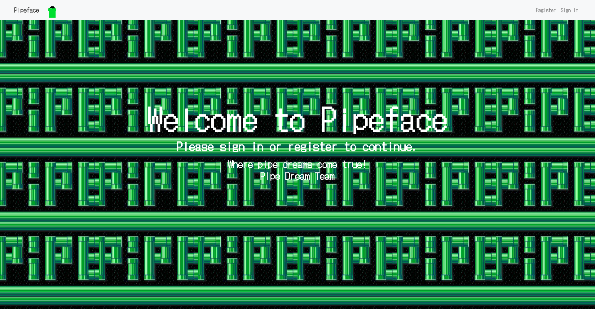
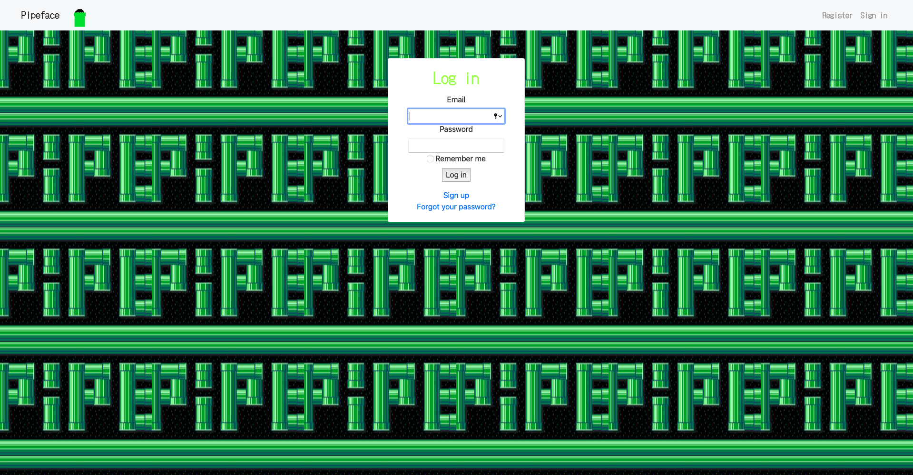
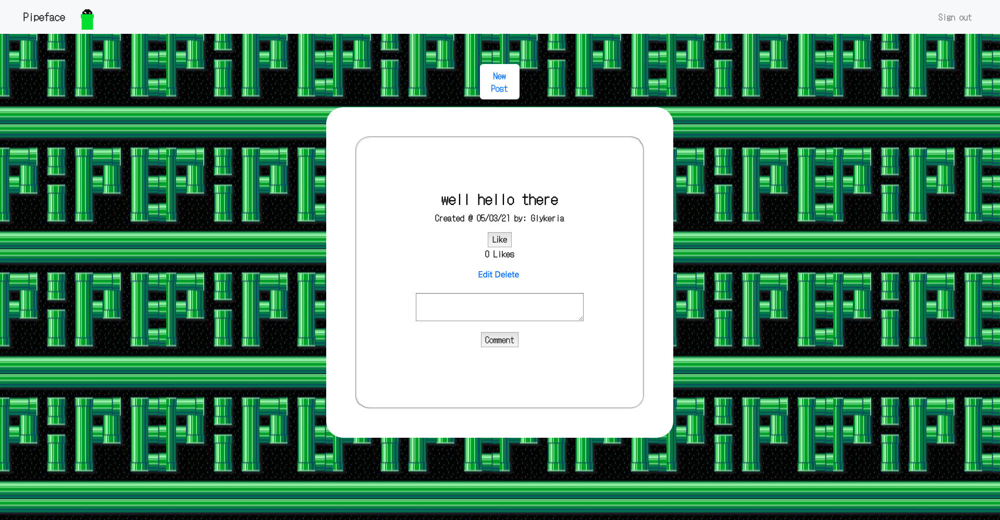

# AceBook - Pipeface

## How to use

#### Download the repo and install packages and setup database

1. Clone repo `git@github.com:GlykeriaStr/acebook--Pipeface-.git`
2. Change directory `cd Pipeface`
3. Install gems `bundle`
4. Create the databases `rails db:create`
5. Migrate the databases `rais db:migrate`

#### Using the app

1. Run local server `rails server`
2. Open browser and head to `http://localhost:3000`

### Screenshots of the app

Index Page

Log in Page

New post page

Feed page

